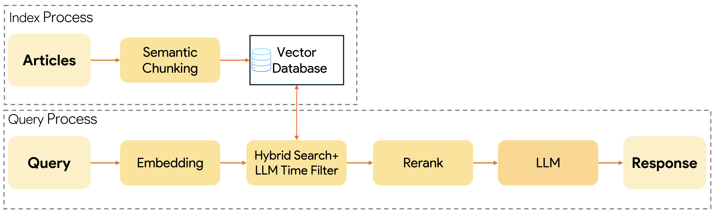
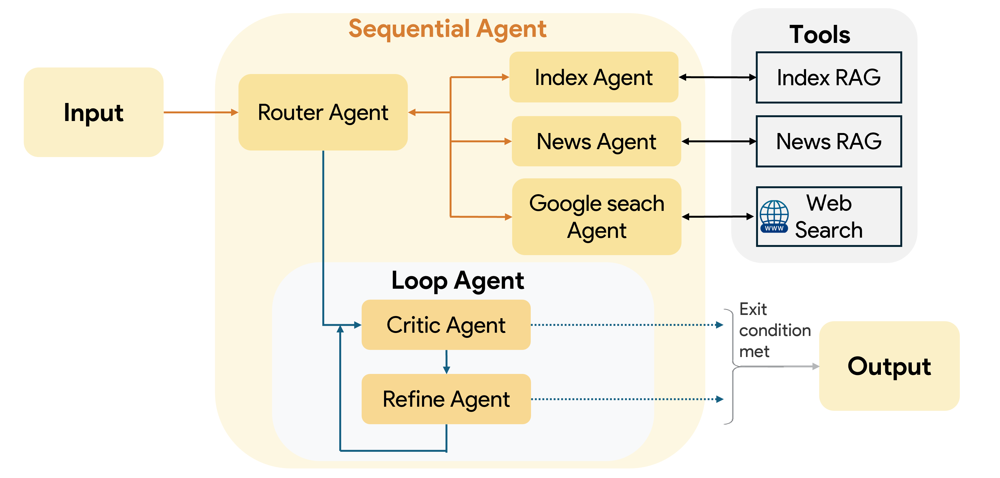

## CÁCH TIẾP CẬN SỬ DỤNG KỸ THUẬT TẠO SINH DỰA TRÊN TRUY  XUẤT TĂNG CƯỜNG VÀ ỨNG DỤNG HỎI ĐÁP   TRÊN DỮ LIỆU TIN TỨC TÀI CHÍNH 
### Quy trình RAG nâng cao

### Kiến trúc hệ thống multi agent agentic rag

### Cài đặt

1.  **Clone Repo:**
    ```bash
    git clone https://github.com/qxuanson/multi-agents-agentic-rag
    cd multi-agent-agentic-rag
    ```

2.  **Cài đặt thư viện:**
    ```bash
    pip install -r requirements.txt
    ```

3.  **API Key:**
    Tạo một tệp `.env` trong thư mục `demo` chứa các API cần thiết.
    ```env
    GOOGLE_API_KEY="YOUR_GOOGLE_API_KEY"
    HUGGINGFACE_KEY="YOUR_HUGGINGFACE_KEY"
    ...
    ```

4.  **Chạy Ứng dụng:**
    ```bash
    adk web
    ```
    Ở giao diện google adk chọn agent-demo
